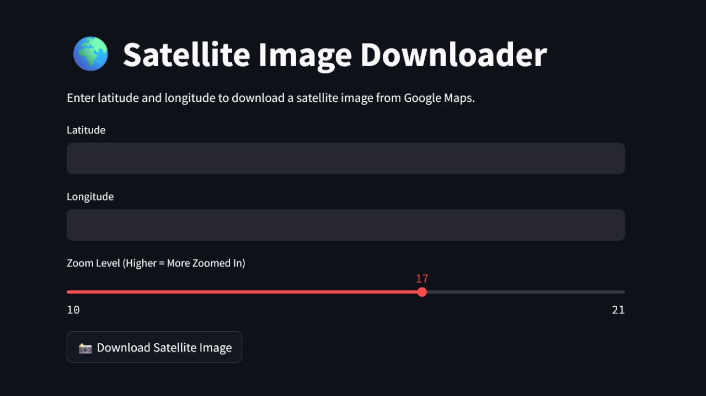

# Satellite Image Downloader using Streamlit and Selenium

This project is a Python-based application that allows users to download satellite images from Google Maps by inputting latitude and longitude coordinates. The application is built using **Streamlit** for the front-end user interface and **Selenium** for automating the process of capturing satellite images from Google Maps.
## 🖼️ Interface

---
## Features
- **User Input**: Users can input latitude and longitude to specify the location for the satellite image.
- **Zoom Control**: A zoom slider allows users to control the zoom level (from 10 to 21), where higher values provide more zoomed-in images.
- **Image Capture**: The app captures a satellite image from Google Maps using Selenium to automate the browser actions.
- **Download Option**: The captured image can be downloaded by the user in PNG format.
- **Consent Handling**: The tool handles potential consent popups that might appear while loading Google Maps.

## Tech Stack
- **Python**: The programming language used for building the application.
- **Streamlit**: A framework for quickly building and deploying interactive web applications in Python.
- **Selenium**: A browser automation tool used to navigate Google Maps and capture the satellite image.
- **ChromeDriver**: A WebDriver for controlling Chrome browser, used with Selenium.
- **WebDriver Manager**: To automatically manage browser drivers (ChromeDriver in this case).

### Prerequisites
- Python 3.x
- Google Chrome
- `chromedriver` installed (WebDriver manager handles this for you.
